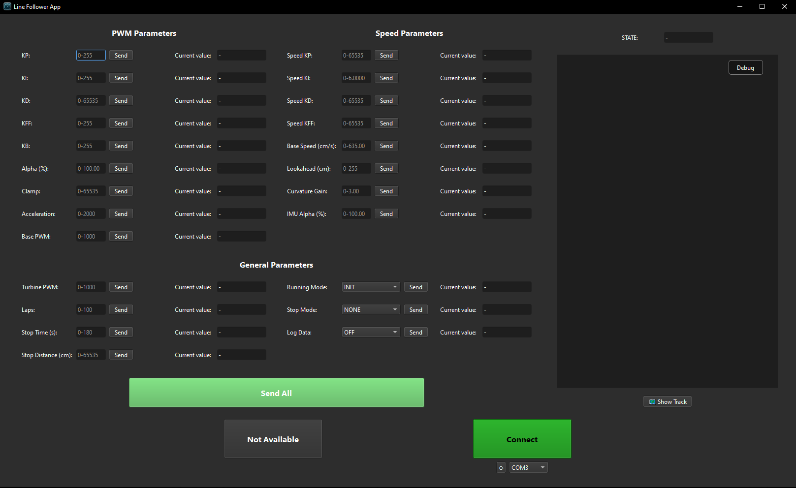
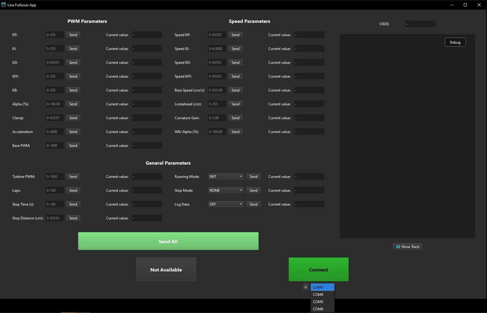
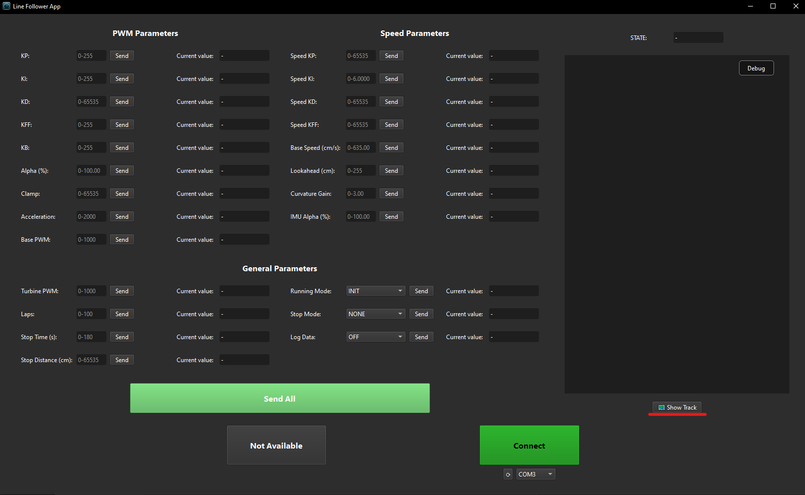
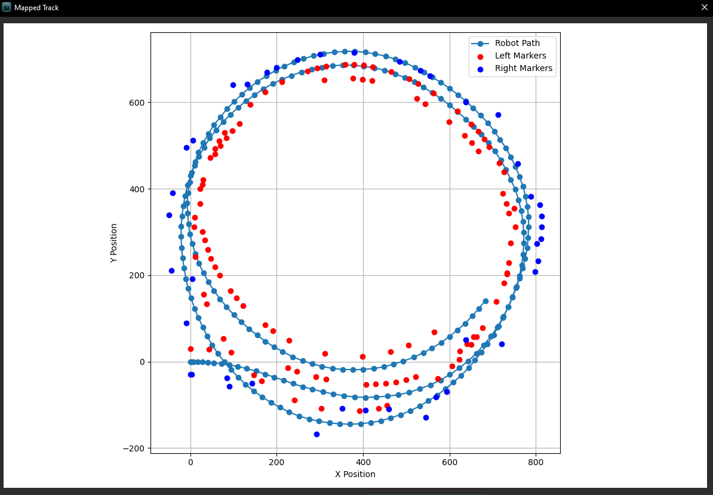

# Line Follower Desktop App 32-bits

This is a desktop application written in Python using `PyQt6` for the user interface. The app is designed to communicate with the Line Follower Robot via serial communication over `bluetooth`, allowing for remote control, monitoring, and debugging of the robot's state and performance.

<div align="center">
  
</div>

## Contents

- [Features](#features)
- [Requirements](#requirements)
- [Project Structure](#project-structure)
- [Usage](#usage)
- [Code Style and Compatibility](#code-style-and-compatibility)
- [How It Works](#how-it-works)
  - [Serial Communication](#serial-communication)
  - [Sender Widget](#sender-widget)
  - [Listener](#listener)
  - [Logging](#logging)
  - [Robot State](#robot-state)
  - [Track Mapping](#track-mapping)
- [Workflow](#workflow)

## Features

- **Serial Communication**: Sends commands to and receives data from the robot using a serial connection and the protocol defined in the [robot's firmware](https://github.com/l1h2/line_follower_stm/blob/main/docs/serial_protocol.md).
- **Real-Time Monitoring**: Displays the robot's current state, sensor data, and other runtime information.
- **Command Sender**: Provides an interface to send predefined commands to the robot, such as starting, stopping, or adjusting parameters.
- **Threaded Listener**: Listens to incoming serial messages in a separate thread to ensure smooth UI operation.
- **Robot State Representation**: Uses a [`LineFollower`](robot/line_follower.py) object as a singleton to represent the robot's current state throughout the application.
- **Track Mapping**: Visualizes the robot's path on a track map based on sensor data, and generates track array files that can be used in the robot's firmware for virtual line following.

## Requirements

The application can be run directly as a Python script or compiled into an executable using tools like `PyInstaller`. The following dependencies are required:

- Python 3.11 or higher
- `PyQt6`
- `pyserial`
- `matplotlib`
- `numpy`
- `pandas`

All dependencies can be installed from the [`requirements.txt`](requirements.txt) file using pip:

```bash
pip install -r requirements.txt
```

## Project Structure

```plaintext
line_follower_app_stm/
├── assets/                # Application assets (icons, images, etc.)
├── docs/                  # Documentation files
├── gui/                   # Graphical User Interface components
│   ├── ui/                # UI elements, such as widgets, layouts and the main window
│   ├── workers/           # Background workers for handling long-running tasks
│   └── main.py            # Entry point for the GUI application
├── robot/                 # Robot-related components
│   ├── api/               # Serial communication bluetooth API
│   ├── line_follower.py   # Singleton object representing the robot
│   └── track_mapper.py    # Handles operation data to generate track maps
├── scripts/               # Auxiliary scripts for testing or setup
├── utils/                 # Utility functions
├── .gitignore             # Git ignore file
├── main.py                # Entry point of the application
├── README.md              # Project README file
└── requirements.txt       # Python dependencies
```

## Usage

1. Clone the repository:

   ```bash
   git clone https://github.com/l1h2/line_follower_app_stm.git
   cd line_follower_app_stm
   ```

2. Install the required dependencies:

   ```bash
    pip install -r requirements.txt
   ```

3. Run the application:

   ```bash
   python main.py
   ```

   or compile it into an executable using the `PyInstaller` [build script](scripts/pyinstaller_build.py):

   ```bash
   python scripts/pyinstaller_build.py
   ```

## Code Style and Compatibility

- Follows PEP 8 style guidelines.
- It uses `black` for code formatting with standard settings.
- Uses `isort` for import sorting with standard settings.
- Compatible with Python 3.11 and above.
- Uses strict type hints for better code clarity and maintainability.
- Includes Google-style docstrings for all public methods and functions.
- Includes simplified docstrings for private methods and functions.
- Uses a custom markdown format for public classes to enhance readability.
- Uses snake_case for variables, functions and file names, while using PascalCase for class names and UPPERCASE for constants.
- Uses `f-strings` for string formatting.

````python
class ExampleClass:
    """
    ### Class Header (optional)

    Summary of the class.

    #### Signals/Properties/Attributes...:
    - `property1 (type)`: Description of property1.
    - `property2 (type)`: Description of property2.

    #### Methods:
    - `method1(param1: type) -> return_type`: Description of method1.
    - `method2()`: Description of method2.

    #### Example:
    ```python
    example = ExampleClass()
    example.method1(param1_value)
    ```
    """

    CONSTANT_VALUE: int = 42

    def public_method(self, param1: type) -> return_type:
        """
        Summary of the method.

        Args:
            param1 (type): Description of param1.

        Returns:
            return_type: Description of the return value.
        """
        print(f"Parameter: {param1}")

    def _private_method(self):
        """Summary of the private method."""
        pass
````

## How It Works



### Serial Communication

The app uses the `pyserial` library to establish a serial connection with the robot using a [`connection API`](robot/api/main.py). It supports both sending and receiving data, with error handling for connection issues. Its main purpose is to connect to the robot's `HC-05` bluetooth module, but it can also be used with a `USB` connection by selecting the appropriate serial port.



This can be used to switch between different connection modes such as `USB` or `Bluetooth`. The app also provides a button to refresh the list of available ports in case the robot is connected or disconnected.

All communication with the robot follows the serial protocol defined in the [robot's firmware documentation](https://github.com/l1h2/line_follower_stm/blob/main/docs/serial_protocol.md), which support both predefined commands and standard logging messages from the robot. The protocol implementation and message parsing can be found in the [serial_protocol.py](utils/serial_protocol.py) file.

### Sender Widget

The [sender widget](gui/ui/widgets/home/sender) provides an interface for sending protocol messages to the robot. It includes predefined commands for starting, stopping, and adjusting parameters.


All messages used in the communication protocol can be found in [serial_protocol.py](utils/serial_protocol.py#L10) and are composed of two parts:

1. **Command ID**: A unique identifier for each command or message type.
2. **Payload**: The data associated with the command, with standard sizes defined in the protocol documentation.

### Listener

The [listener](gui/ui/widgets/home/listener/) runs a [worker](gui/workers/listener.py) in a separate thread to handle incoming serial messages without blocking the UI. It processes the received messages and updates the `LineFollower` object accordingly. It also manages the main text display, where all incoming messages are shown.


The `Debug` button can be pressed to toggle printing of protocol messages to the console, allowing for a less cluttered view of the main text display.


The listener thread also handles connection update events and other communication errors.

### Logging

The app logs all incoming messages to files in the [`data`](data) folder. This is useful for debugging and analyzing the robot's performance over time and can be used alongside helper [scripts](scripts) for data visualization and track mapping.

For track mapping files, the app clears all log data when the robot starts a new run. This is done so that the Show Track feature only displays data from the current run. So if a specific run needs to be saved, the log files should be copied before starting a new run.



### Robot State

The app uses a singleton `LineFollower` object defined in [line_follower.py](robot/line_follower.py#L52) to represent the robot's current state. This object is updated in real-time based on incoming serial messages and is accessible from any part of the application. For more information on the line follower robot, please refer to the [robot's repository](https://github.com/l1h2/line_follower_stm).

### Track Mapping

The app includes a track mapping feature that visualizes the robot's path on a track map based on sensor data. It uses the `TrackMapper` class defined in [track_mapper.py](robot/track_mapper.py) to process the operation data and generate track log files that can be used to generate track array files for the robot's firmware and plot the robot's path.

For visualization, the app uses `matplotlib` to plot the robot's path on a 2D graph, showing the track layout and the robot's trajectory. This can be done either by pressing the `Show Track` button in the UI or by using the [line_drawing.py](scripts/line_drawing.py) script for custom control over the plotting process.



The track mapping feature can also generate track array files that can be used in the robot's firmware for virtual line following, by running the [array_mapper.py](scripts/array_mapper.py) script. This is done by processing the logged operation data and extracting the necessary information to create the track arrays. The generated track array files are saved in the [`data/tracks`](data/tracks) folder under `track_name.h` for the header and `track_name.c` for the source file. For more information on how to add the generated track files to the robot's firmware, please refer to the [robot's repository](https://github.com/l1h2/line_follower_stm/blob/main/README.md#track-mapping).

## Workflow

1. **Start the App**: Run the application using `python main.py` or the compiled executable.
2. **Connect to the Robot**: Select the appropriate serial port and connect to the robot using the port selector widget.
3. **Monitor Data**: Observe the robot's state and incoming messages in real-time through the listener widget.
4. **Send Commands**: Use the sender widget to set configuration parameters to in the robot.
5. **Choose Operation Mode**: Select the desired `RUNNING_MODE` from the dropdown menu.
6. **Start a Run**: Press the `Start` button to begin a new run. The app will log data and update the robot state accordingly.
7. **Change Parameters**: Adjust parameters as needed during the run using the sender widget.
8. **Stop the Run**: Press the `Stop` button to end the run or wait for the selected `STOP_MODE` to trigger an automatic stop.
9. **Visualize Track**: After the run, press the `Show Track` button to visualize the robot's path on the track map.
10. **Generate Track Arrays**: Use the [array_mapper.py](scripts/array_mapper.py) file to generate track array files for the robot's firmware based on the logged data.
